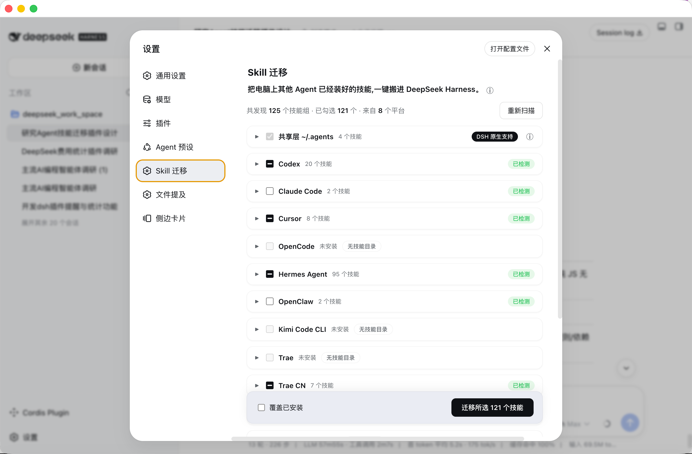

<p align="center"><a href="README.en.md">English</a>&nbsp;&nbsp;|&nbsp;&nbsp;<a href="README.md">简体中文</a></p>

# DSH Skill Mover

Move skills already installed in other agents into DeepSeek Harness in one click.

Scans and migrates skills from 14 agent platforms (Cursor / Claude Code / Codex / OpenCode / Hermes / OpenClaw / Kimi / Trae / Trae CN / CodeBuddy / Qwen Code / Qoder / Qoder CN / QoderWork): recognizes the shared layer (`~/.agents/skills`) automatically, merges same-name skills, never copies the same skill twice, and skills are usable in DSH right after migration.

## Preview



Settings → Skill Mover: skills found on your machine are grouped by platform, check what you want, migrate in one click.

## Features

- 🔍 **Auto scan**: open the page and see every skill installed in every agent on your computer
- ☑️ **Check & migrate**: check the ones you want, migrate dozens at once
- 🧩 **Same-name merge**: when several agents share the same skill, it is installed once — pick the source freely
- 🔗 **No duplicates**: when agents actually point to the same skill, it is detected and counted once
- ↩️ **Undo anytime**: remove a wrong migration in one click without touching other installed skills
- 📦 **Copied, never moved**: DSH gets its own copy; the original agent keeps working as before
- 🧹 **Auto normalization**: non-standard skill names are fixed to a format DSH understands
- 🌍 **All three OSes**: macOS / Linux / Windows

## Supported platforms

| Platform | Skill dir (macOS/Linux) | Windows |
|---|---|---|
| Shared layer (native to DSH) | `~/.agents/skills` | `C:\Users\<username>\.agents\skills` |
| Codex | `~/.codex/skills` | `C:\Users\<username>\.codex\skills` |
| Claude Code | `~/.claude/skills` | `C:\Users\<username>\.claude\skills` |
| Cursor | `~/.cursor/skills` | `C:\Users\<username>\.cursor\skills` |
| OpenCode | `~/.config/opencode/skills` | `C:\Users\<username>\.config\opencode\skills` |
| Hermes Agent | `~/.hermes/skills` | `C:\Users\<username>\AppData\Local\hermes\skills` |
| OpenClaw | `~/.openclaw/skills` | `C:\Users\<username>\.openclaw\skills` |
| Kimi Code CLI | `~/.kimi/skills` | `C:\Users\<username>\.kimi\skills` |
| Trae (international) | `~/.trae/skills` | `C:\Users\<username>\.trae\skills` |
| Trae CN (China) | `~/.trae-cn/skills` | `C:\Users\<username>\.trae-cn\skills` |
| CodeBuddy | `~/.codebuddy/skills` | `C:\Users\<username>\.codebuddy\skills` |
| Qwen Code | `~/.qwen/skills` | `C:\Users\<username>\.qwen\skills` |
| Qoder CLI | `~/.qoder/skills` | `C:\Users\<username>\.qoder\skills` |
| Qoder CN CLI | `~/.qoder-cn/skills` | `C:\Users\<username>\.qoder-cn\skills` |
| QoderWork | `~/.qoderwork/skills` | `C:\Users\<username>\.qoderwork\skills` |

> All paths verified against official docs or source code. See [`docs/agent-skills-migration-research.md`](docs/agent-skills-migration-research.md) for details.

## Install

**One command, permanent install (recommended)**:

```sh
dsh plugin --profile web add github:mjylfz/dsh-skill-mover
```

Restart DSH after installing, then open **Settings → Skill Mover**.

**Try it without installing (session-scoped)**: send the repo link `https://github.com/mjylfz/dsh-skill-mover` to your DSH assistant and say "install this plugin and run it". The assistant reads the plugin files and loads them; after you approve, use it from **Settings → Skill Mover** (session-scoped plugins need to be reloaded after a restart).

## Usage

1. Open **Settings → Skill Mover**
2. The page scans skill directories of every agent on your machine, grouped by platform
3. Expand a platform card to see its skill list, check the skills to migrate (same-name skills from multiple platforms can expand to switch source)
4. Click **"Migrate N selected skills"** at the bottom (copy mode: DSH gets an independent copy; the original directory is not affected)
5. DSH discovers new skills automatically — **no restart needed**; the results page offers "Remove this migration" for rollback

### Interaction rules

- Shared-layer skills marked "native to DSH" are checked by default — nothing to do, DSH can already use them
- When the same skill exists on several platforms, checking it on any platform selects that platform as the source; all platform sections stay in sync
- Skills already present in DSH are unchecked by default to avoid duplicates (check "Overwrite installed" to update)
- Skills that are literally the same file as the shared layer (e.g. symlinked there) are unchecked by default — migrating them would just duplicate

### Is it usable right after migration?

Yes. A skill is "instructions + bundled assets", not an installer. After migration:

- **DSH recognizes it immediately**: the AI automatically opens the instructions when it hits a related task — no extra steps from you (verified with DSH's own discovery)
- **Some skills need libraries**: e.g. Python or Node packages. DSH will not silently run install commands (to keep untrusted skills from installing things). If a skill really needs such libraries, the AI installs them per the skill's own instructions, and the results page lists skills with dependency declarations so you can install manually when needed

## FAQ

**Q: How do I use a skill after migration? Do I need to do anything?**

Nothing extra. DSH recognizes migrated skills automatically and the AI calls them when relevant. You can also just say it, e.g. "use baoyu-cover-image to make a cover for this post". If a skill does not trigger by itself, explicitly say "please use the xx skill".

**Q: Does migration affect the original agent?**

No. Migration copies; it does not move. The original directory stays untouched and the original agent keeps working.

**Q: The same skill exists on multiple platforms — will it be installed twice?**

No. Same-name skills are merged into one group and installed once; you pick the source (shared layer or the highest-priority source by default).

**Q: The skill is missing or not working after migration?**

Check whether the skill appears under `~/.dsh/skills/`; make sure its instruction file is well-formed (the plugin fixes non-standard names automatically during migration); then try a new session.

**Q: Do skills need dependencies (pip / npm) installed?**

Depends on the skill. Pure instruction skills work immediately; skills with script dependencies are installed by the AI per the skill's instructions, or manually per the migration results page. The plugin never runs install scripts itself (safety).

**Q: How do I undo a migration?**

On the results page click "Remove this migration" — the migrated skills are deleted, the original directories are untouched.

**Q: Does it support Windows?**

Yes. Path rules, copy commands (robocopy) and linking (junction) are adapted for Windows.

## Repository structure

```
dsh-skill-mover/
├── skill-migrator-host.js      # Plugin host half: scan / conflict planning / migration / RPC
├── skill-migrator-client.js    # Plugin client half: settings UI (settings.section)
├── docs/
│   ├── agent-skills-migration-research.md   # Research on 15 platforms' skill directories
│   └── dsh-skill-migrator-design.md         # Design doc (architecture / conflict strategy / Windows notes)
```

## Development & testing

Pure JavaScript, no build step; the host half has zero external dependencies (hand-written frontmatter parser and path utilities) and works through DSH's `ctx.fs` / `ctx.shell` services.

Local regression tests run `runScan` / `runMigrate` / `runRemove` against mock `fs`/`shell` services over the real filesystem, then verify migrated skills are discoverable and fully loadable using DSH's official `dsh-skill-filesystem` provider (verified).

## License

[MIT](LICENSE)
